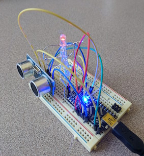

# Arduino Charlieplexing
___

## [What is Charlieplexing?](https://en.wikipedia.org/wiki/Charlieplexing)

> Charlieplexing is a technique for driving a multiplexed display in which relatively few I/O pins on a microcontroller are used e.g. to drive an array of LEDs.

## Integration with HC-SR04

As this prototype shows, I will be using charlieplexing to map distances from the distance sensor to a specific LED on a column. Eventually this technique will be expanded to two more axises and a 4x4x4 LED cube to track a fist's position in space. 